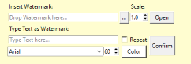

# Image Watermarker in Tkinter

### How does it work?
- Simply open the .exe file and insert the image to watermark in this entry (you can use also an image url):

- Then you can choose an image or type some text in the appropriate entries to create watermarks:

- As you can see there's different options to further edit your watermarks.

### Here's a demo for you to check out!

**Thank you for taking the time to check it out!**

**Feel free to download this project and use it as you wish!**
